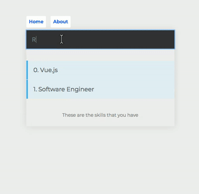

# VueSkillsApp

Basic list app made with Vue.js and thank you to Gary Simon for tutorial and codebase: https://coursetro.com/courses/23/Vue-Tutorial-in-2018---Learn-Vue.js-by-Example

1. create repo and npm install vue && npm install -g @vue/cli 
2. start vue create vue-proj and choose default
3. cd into project folder and yarn serve
4. open http://localhost:8080/ 

Terms to know: 
Vue component structure: <template>, <script>, <style> && Vue features: 'interpolations' use {{ }} while 'directives' are attributes with a v- [ex: v-bind, v-on, v-if, v-text, etc]

